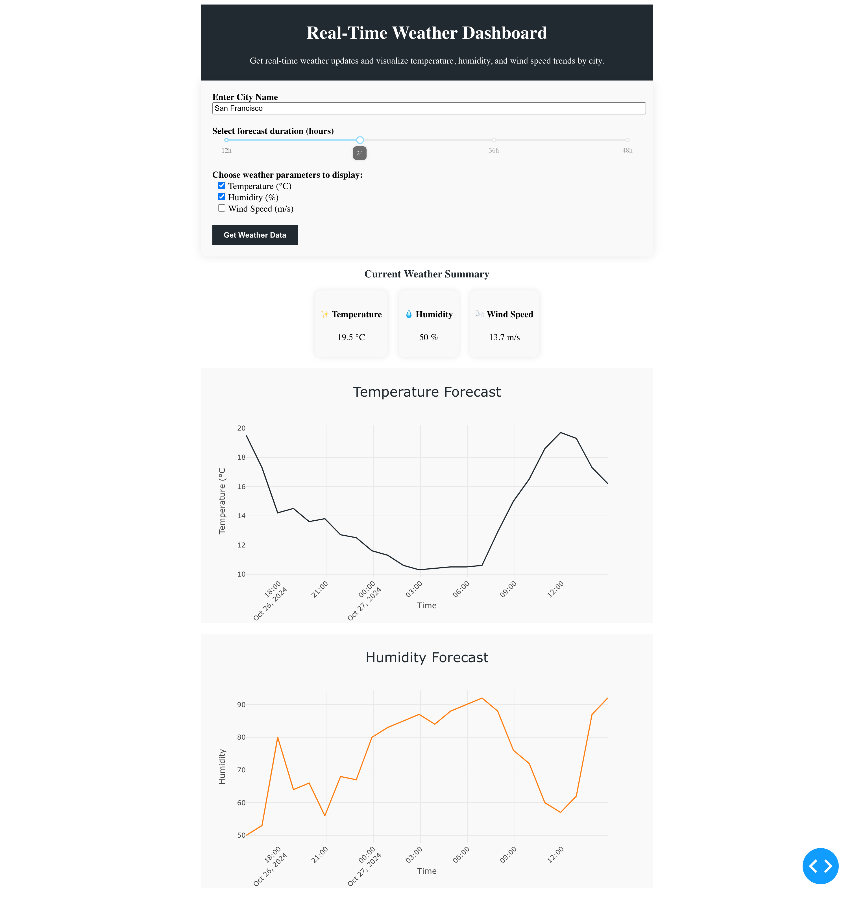

# 🌦️ Real-Time Weather Dashboard



This repository contains a Python-based web application that provides real-time weather updates for any city. The application is built using Plotly Dash and provides a user-friendly interface to visualize temperature, humidity, and wind speed trends for a selected city.

## ✨ Features

- 🌍 **Real-time Weather Updates**: Get the latest weather information for any city by simply entering its name.
- 📊 **Weather Visualization**: Visualize temperature, humidity, and wind speed trends over a specified forecast duration.
- 🖥️ **Interactive UI**: User-friendly interface built using Plotly Dash for easy selection of weather parameters and forecast duration.

## 🛠️ Technologies Used

- 🐍 **Python**
- 📈 **Dash (Plotly)**
- 🌤️ **Open-Meteo API** for weather data
- 🗺️ **Nominatim API** for geocoding city names

## ⚙️ Installation

1. **Clone the repository**:

   ```sh
   git clone https://github.com/yourusername/city_weather_dashboard.git
   cd city_weather_dashboard
   ```

2. **Create a virtual environment**:

   ```sh
   python -m venv venv
   ```

3. **Activate the virtual environment**:

   - **Windows**: `venv\Scripts\activate`
   - **macOS/Linux**: `source venv/bin/activate`

4. **Install the required packages**:
   ```sh
   pip install -r requirements.txt
   ```

## 🚀 Usage

1. **Run the application**:

   ```sh
   python city_weather_dashboard.py
   ```

2. **Open a browser** and go to `http://127.0.0.1:8050/` to access the weather dashboard.

## ⚡ How It Works

- 🔎 **City Name Input**: Users can enter any city name, and the application fetches the latitude and longitude using the Nominatim API.
- 🌡️ **Weather Data Fetching**: The weather data for the selected city is retrieved from the Open-Meteo API.
- 📉 **Interactive Graphs**: The application visualizes the temperature, humidity, and wind speed trends for the selected forecast duration (12 to 48 hours).
